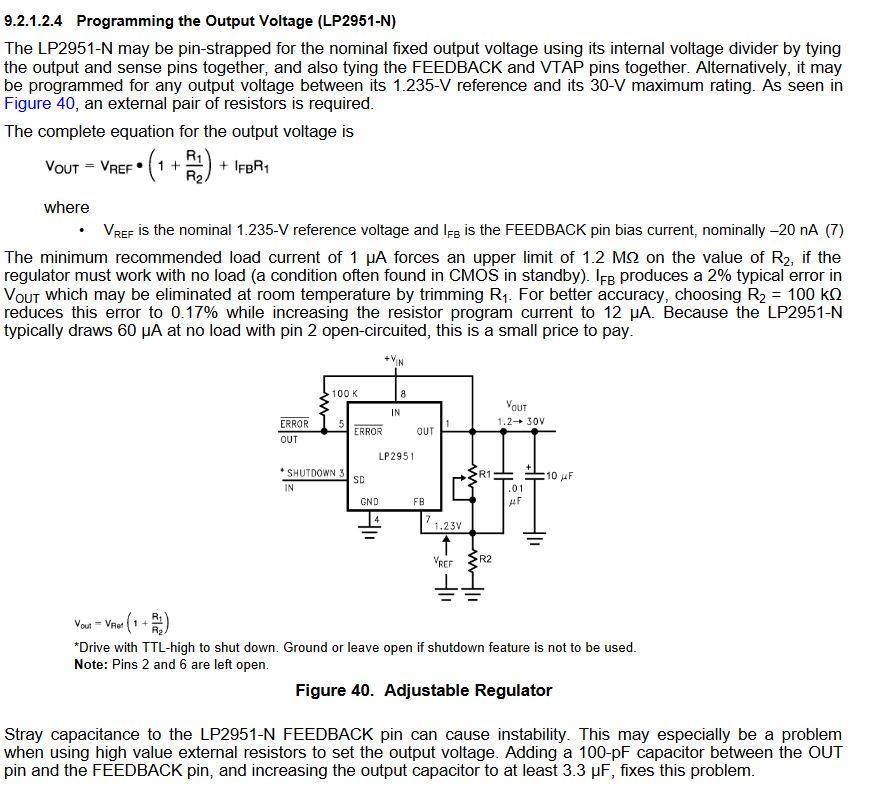
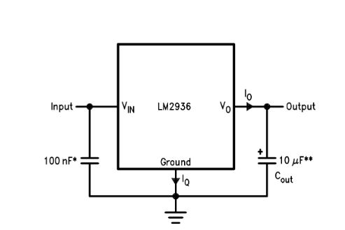

Voltage Regulator:
https://www.jaycar.com.au/voltage-regulator-lp2951acn/p/ZV1646?pos=3&queryId=d660c669b1f2f3481c46d3c2a7fe8ed6&sort=relevance

Voltage Regulator for ADC:
https://www.jaycar.com.au/medias/sys_master/images/images/9662793187358/ZV1650-dataSheetMain.pdf

ADC:
- Line level can go up to 1.736V.
- For 3.5mm jacks, the tip is left audio, ring 1 is right audio and ring 2 is ground.

Amplifier for input:
https://www.jaycar.com.au/lm358-low-power-dual-op-amp-linear-ic/p/ZL3358?pos=8&queryId=e7c478f4ca30f0db7ba322e5a4d3a3a7&sort=relevance

Audio input socket:
https://www.jaycar.com.au/3-5mm-stereo-switched-pcb-socket/p/PS0133?pos=1&queryId=4ee67a1de80626d4516e75cbaa030d39&sort=3.relevance

Board for connecting components
https://www.jaycar.com.au/universal-pre-punched-experimenters-board-small/p/HP9550
https://www.jaycar.com.au/universal-pre-punched-experimenters-board-large/p/HP9554

Motor for haptic feedback
https://www.altronics.com.au/p/ja0070-smd-motor-vibration-2.7v/
