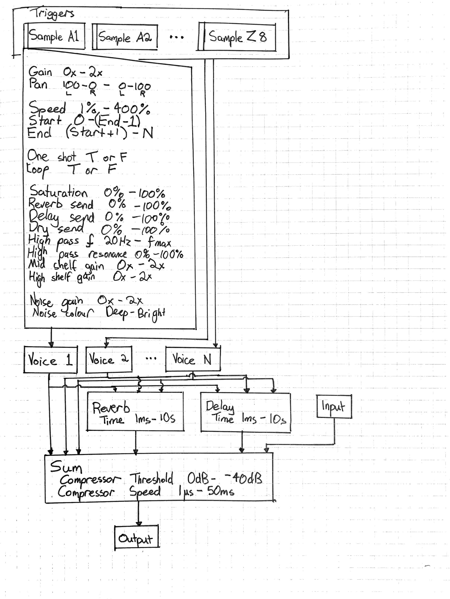

Physical:
- 8 Sound Triggers
- 4 Bank Selectors
- 2 Coarse, Absolute encoders for Parameter 1 and 2
- 2 Fine, Endless encoders for Parameter 1 and 2
- Sample parameters
    - Gain
    - Pan
    - Speed
    - Start
    - End
- Sample options
    - One shot / Gate
    - Loop
- Sample effect parameters
    - Saturation
    - Reverb send amount
    - Delay send amount
    - High pass cutoff
    - High pass resonance
    - Mid shelf gain
    - High shelf gain
    - Noise gain
    - Noise colour
- Global parameters
    - Reverb time
    - Delay time
    - Compressor threshold
    - Compressor speed
    - Input gain
    - Output gain

